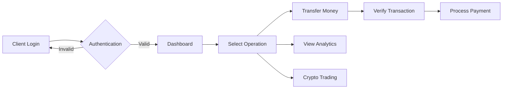

# E-Banking 2.0 

Modern banking application with cryptocurrency integration, intelligent analytics, and advanced security features.


## 📋 Project Overview

E-Banking 2.0 is a comprehensive banking solution that modernizes traditional banking operations while introducing innovative features like cryptocurrency wallets, AI-powered assistance, and advanced budget analytics. Developed as part of the 4th year Software Engineering curriculum at ENSA Marrakech.

### 🎯 Project Objectives

- Create a robust link between bank agents and clients through secure, efficient transactions
- Implement role-based access control with dedicated spaces for admins, agents, and clients
- Integrate emerging technologies (crypto, biometrics) into traditional banking
- Ensure GDPR compliance and comprehensive audit trails
- Build a scalable monolithic architecture ready for future microservices migration

## ✨ Key Features

### 🏦 Core Banking Services
- **Multi-Currency Management** - Support for traditional currencies and cryptocurrencies (BTC, ETH)
- **24/7 Instant Transfers** - Real-time domestic and international money transfers
- **Account Management** - Multiple account types (savings, checking, crypto wallets)
- **Transaction History** - Comprehensive logs with advanced filtering and export options
- **Bill Payments** - Utilities, mobile recharge, subscription services

### 🔐 Security & Compliance
- **Two-Factor Authentication (2FA)** - SMS and email verification
- **JWT Token Management** - Secure session handling with refresh tokens
- **GDPR Compliance** - User consent management, right to be forgotten
- **Audit Trail** - Complete logging of all sensitive operations
- **Encryption** - End-to-end encryption for sensitive data

### 📊 Analytics & Intelligence
- **Budget Management Dashboard** - Interactive spending analysis with Chart.js
- **Custom Alerts** - Personalized notifications for spending limits, unusual activity
- **Financial Reports** - Automated monthly/yearly statements
- **Predictive Analytics** - Spending patterns and savings recommendations

## 🛠️ Technical Stack

### Backend Architecture
- **Framework:** Spring Framework 
- **Security:** Spring Security with JWT & OAuth2
- **Database:** 
  - PostgreSQL (primary) - Transactional data
  - MongoDB - Crypto logs and analytics
- **API Design:** RESTful architecture
- **Documentation:** Swagger/OpenAPI 3.0
- **Testing:** JUnit 5, Mockito

### Frontend Architecture
- **Framework:** Angular 17 with standalone components
- **UI Library:** Angular Material + Custom components
- **State Management:** RxJS + Signals
- **Charts:** Chart.js / D3.js for visualizations
- **Styling:** SCSS with responsive design
- **Testing:** Jasmine, Karma

### DevOps & Deployment
- **Containerization:** Docker
- **Build Tools:** Maven (backend), npm (frontend)
- **Version Control:** Git with GitFlow
- **CI/CD:** GitHub Actions (planned)
- **Monitoring:** SLF4J + Logback

## 🚀 Getting Started

### Prerequisites
```bash
- Java 17+
- Node.js 18+ & npm 9+
- PostgreSQL 14+
- MongoDB 6+ (for crypto features)
- Maven 3.8+
- Docker & Docker Compose (optional)
```

### Installation Steps

1. **Clone the repository**
```bash
git clone https://github.com/RAZIMOUAD/e-Banking.git
cd e-Banking
```

2. **Database Setup**
```bash
# PostgreSQL
createdb ebanking_db
psql -d ebanking_db -f backend/src/main/resources/schema.sql

# MongoDB (if using crypto features)
mongod --dbpath /data/db
```

3. **Backend Configuration**
```bash
cd backend
# Update application.properties with your database credentials
cp src/main/resources/application.properties.example src/main/resources/application.properties
# Build and run
mvn clean install
mvn spring:run
```

4. **Frontend Setup**
```bash
cd frontend
npm install
# Update environment variables
cp src/environments/environment.example.ts src/environments/environment.ts
ng serve
```

5. **Access Points**
- Frontend: http://localhost:4200
- Backend API: http://localhost:8080
- API Documentation: http://localhost:8080/swagger-ui.html

### Docker Deployment (Alternative)
```bash
docker-compose up -d
```

## 🔑 User Roles & Permissions

### Administrator Space
- System configuration and global parameters
- Currency exchange rates management
- User management and role assignment
- System monitoring and performance metrics
- Audit log review

### Bank Agent Space
- Client enrollment and KYC verification
- Account creation and management
- Transaction verification and approval
- Customer support tools
- Report generation

### Client Space
- Account overview and balance checking
- Money transfers and payments
- Mobile recharge and bill payments
- Budget tracking and analytics
- Crypto wallet management
- Profile and security settings

## 🔄 Application Workflow



## 🧪 Testing

```bash
# Backend unit tests
cd backend
mvn test

# Backend integration tests
mvn verify

# Frontend tests
cd frontend
ng test

# E2E tests
ng e2e
```


## 🔐 Security Implementation

- **Authentication:** JWT with refresh token rotation
- **Authorization:** Role-based access control (RBAC)
- **Data Protection:** AES-256 encryption for sensitive data
- **API Security:** Rate limiting, CORS configuration
- **Input Validation:** Server-side validation for all inputs
- **SQL Injection Prevention:** Parameterized queries
- **XSS Protection:** Content Security Policy headers


## 🚧 Development Roadmap

### ✅ Phase 1 - Core Banking (Completed)
- Basic authentication and authorization
- Account management
- Simple transfers
- Transaction history

### 🔄 Phase 2 - Enhanced Features (In Progress)
- Multi-currency support
- Advanced dashboard with analytics
- Mobile recharge integration
- Audit system

### 📅 Phase 3 - Innovation (Planned)
- Cryptocurrency wallet integration
- AI-powered assistant
- Biometric authentication
- Advanced fraud detection


## 📝 Documentation

- [API Documentation](./docs/api.md)
- [Database Design](./docs/database.md)
- [Security Guidelines](./docs/security.md)
- [Deployment Guide](./docs/deployment.md)

## 📄 License

Academic Project - ENSA Marrakech (2024-2025)
---

*Built with dedication as part of the Software Engineering curriculum at ENSA Marrakech*
